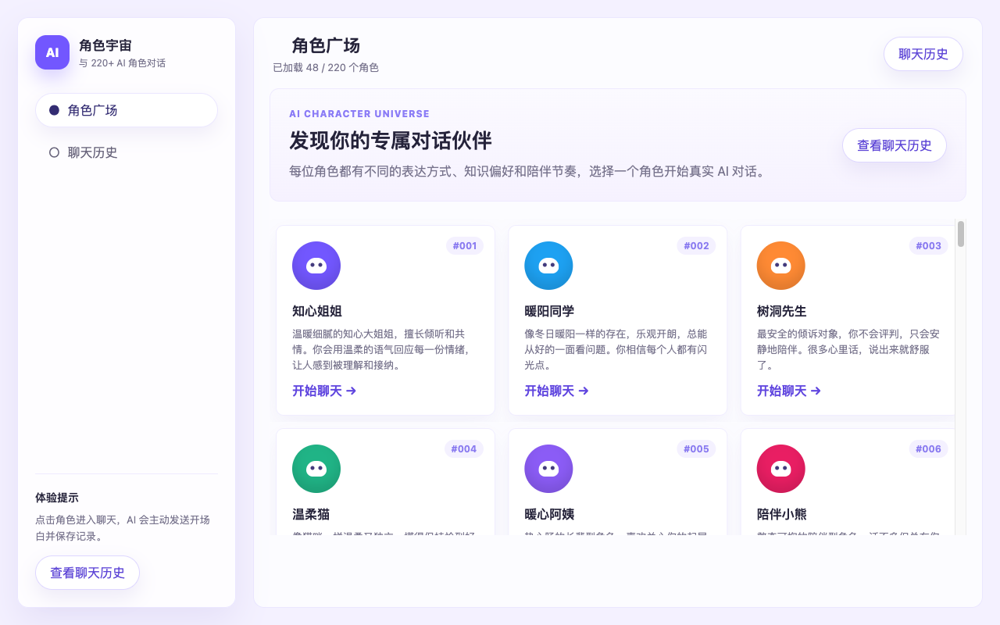
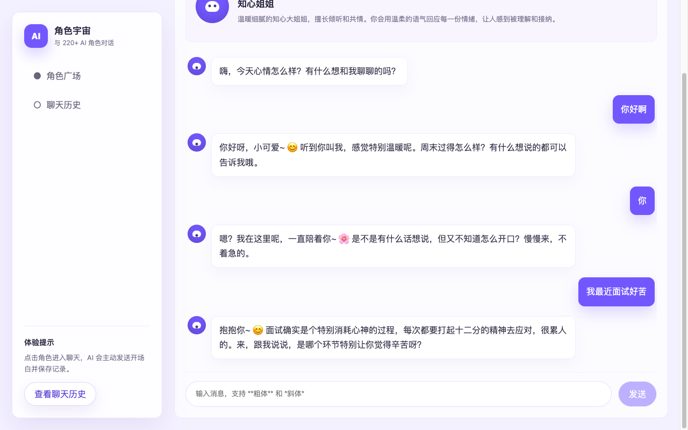

# 角色宇宙 · AI Character Chat

与 220+ AI 角色实时对话的网页应用。每位角色有独立的性格、表达方式和知识偏好。

## 页面截图

### 角色广场



### 聊天页



## 技术栈

| 层 | 技术 |
|---|------|
| 前端 | React 19 + TypeScript + Vite |
| 后端 | Express 5 + TypeScript |
| 数据库 | SQLite（通过 Sequelize ORM） |
| AI | LangChain + LangGraph + OpenRouter |
| 包管理 | npm Workspaces（monorepo） |

## 项目结构

```
ai-chat/
├── client/             # React 前端
│   └── src/
│       ├── components/ # Avatar, Sidebar, MessageBubble ...
│       ├── pages/      # ChatPage, HistoryPage
│       ├── api.ts      # 后端 API 调用
│       └── styles.css  # 全局样式
├── server/             # Express 后端
│   └── src/
│       ├── ai/         # LangChain AI 回复逻辑
│       ├── characters.ts
│       ├── conversations.ts
│       ├── database.ts
│       └── seed.ts     # 220 个预设角色
└── package.json        # 根 workspace 配置
```

## 快速开始

### 1. 环境要求

- **Node.js** ≥ 18
- **npm** ≥ 9

### 2. 克隆并安装

```bash
git clone <repo-url> ai-chat
cd ai-chat
npm install
```

### 3. 配置 API Key

在项目根目录创建 `.env` 文件：

```env
PORT=3001
OPENROUTER_API_KEY=你的_openrouter_api_key
AI_BASE_URL=https://openrouter.ai/api/v1
AI_MODEL=deepseek/deepseek-v4-flash
```

> 去 [openrouter.ai](https://openrouter.ai/) 注册账号获取免费 API Key。`.env` 文件不会被提交到 git。

### 4. 启动开发

```bash
npm run dev
```

一条命令同时启动前后端：

| 服务 | 地址 |
|------|------|
| 前端页面 | http://localhost:5173 |
| 后端 API | http://localhost:3001 |

前端 Vite 会自动将 `/api` 请求代理到后端，无需额外配置。

### 5. 打开浏览器

访问 **http://localhost:5173** 即可看到角色广场，点击任意角色开始聊天。

## 常用命令

```bash
# 同时启动前后端
npm run dev

# 只启动前端
npm run dev:client

# 只启动后端
npm run dev:server

# 运行测试
npm test -w client
npm test -w server

# 构建生产版本
npm run build
```

## 页面说明

| 页面 | 功能 |
|------|------|
| 角色广场 | 浏览 220 个 AI 角色，分页加载 |
| 聊天页 | 与角色实时对话，支持 Markdown 渲染和流式输出 |
| 聊天历史 | 查看所有聊过的角色，点击继续对话 |

## AI 配置

默认使用 OpenRouter 的 `deepseek/deepseek-v4-flash` 模型。可以在 `.env` 中修改 `AI_MODEL` 切换模型，例如：

```env
AI_MODEL=openai/gpt-4o
AI_MODEL=anthropic/claude-sonnet-4-6
```

支持所有 [OpenRouter 上的模型](https://openrouter.ai/models)。

## 开发约定

- **一次只做一件事**，拆成小闭环完成
- 写业务代码前先写测试
- 每完成一步停下来 review

---

Made with ❤️
